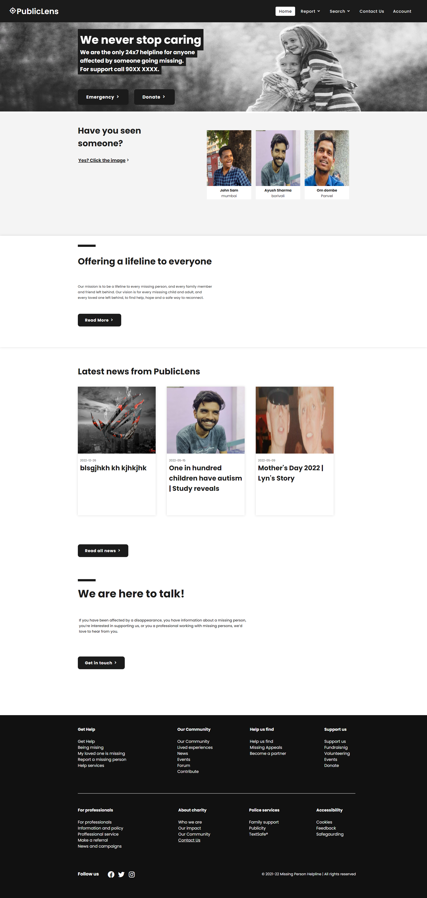
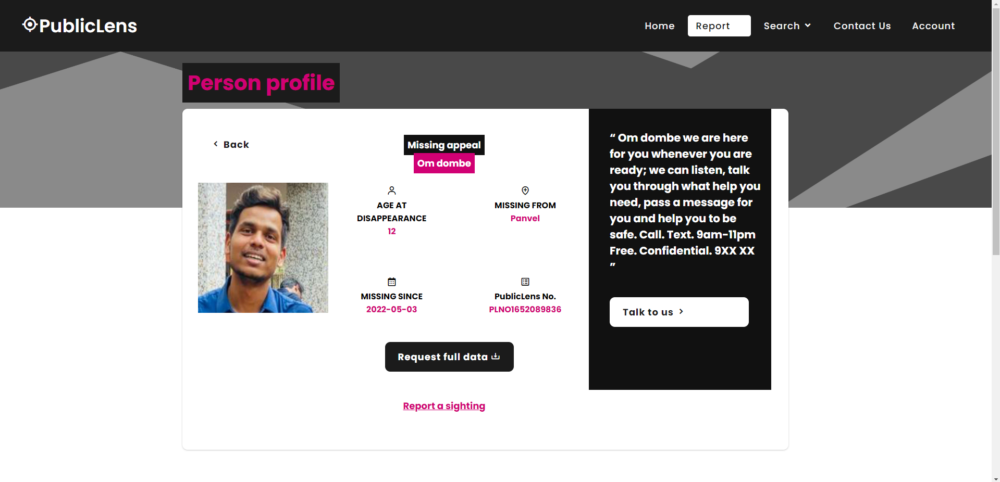
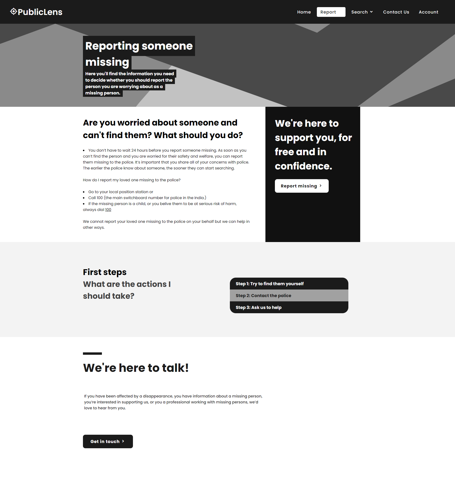
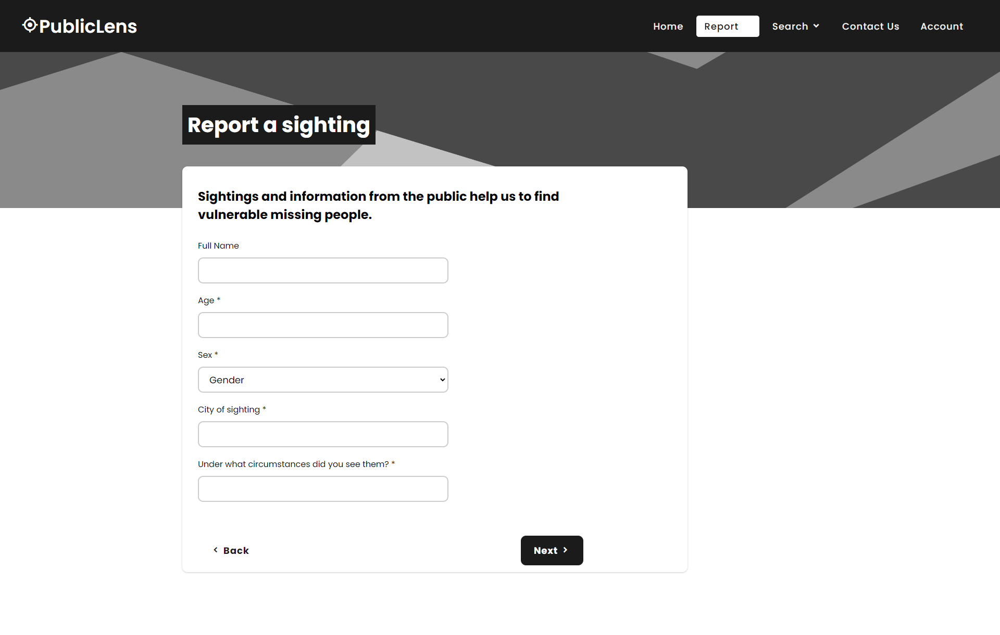
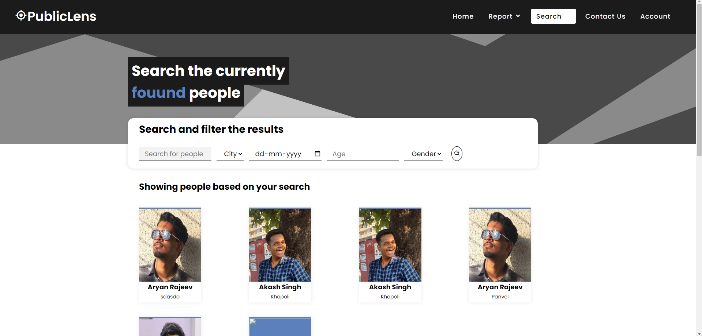
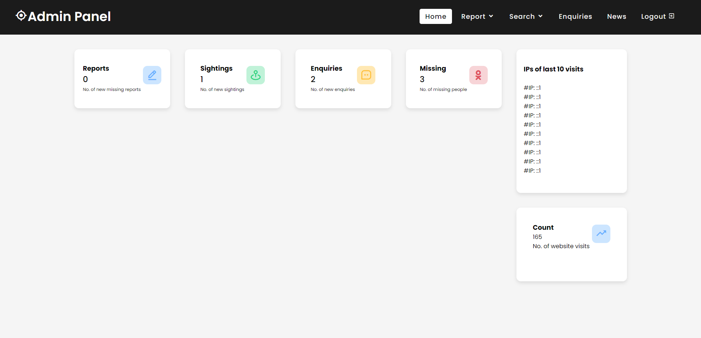
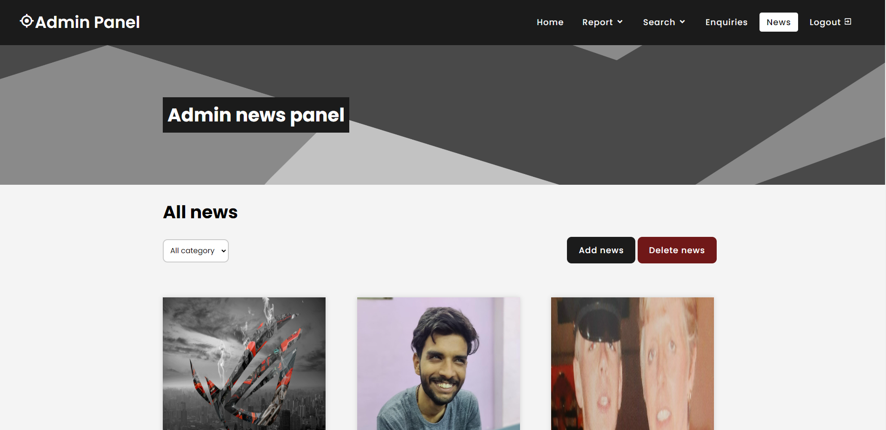
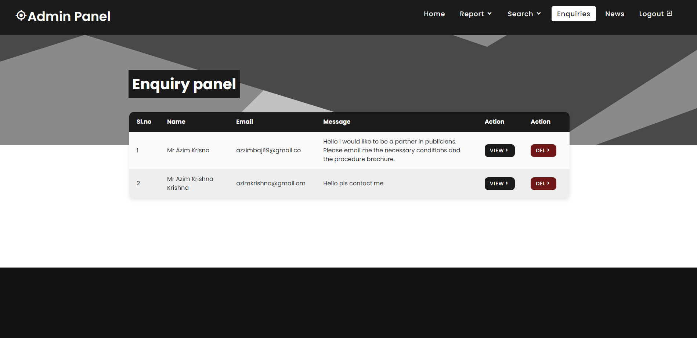
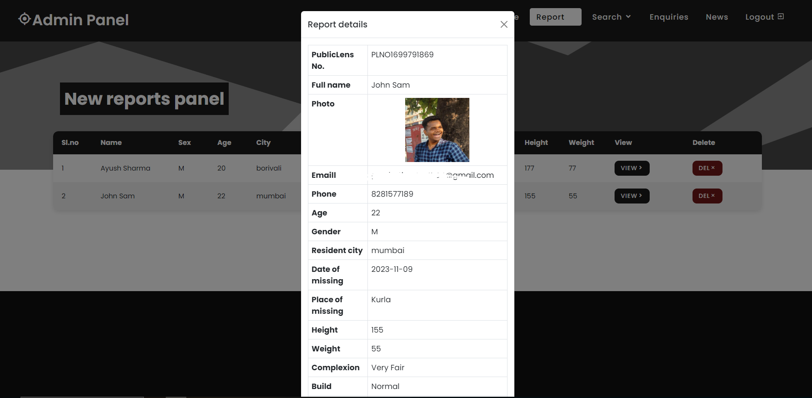

# PublicLens: Missing Persons and Sightings Reporting Website :mag:

## Overview :rocket:

Welcome to PublicLens, your community-powered platform for posting missing persons and reporting sightings. This dynamic website serves as a hub for connecting missing individuals with potential sightings, aiding law enforcement and concerned citizens in their efforts.

Developed using HTML, CSS, JavaScript, PHP, and MySQL, PublicLens offers a user-friendly interface to raise awareness, contribute tips, and help reunite families.

## Features 🌟

### For Users :busts_in_silhouette:

- **Random Spotlights**: The home page presents three randomly selected missing persons profiles, increasing the chances of spotting them.
- **Stay Informed**: Scroll down for the latest news and announcements about missing individuals and successful reunions.
- **Report Sightings**: Even if you're not registered, you can report sightings, playing a vital role in locating missing persons.
- **Missing Person Details**: Click on a profile for more information, and if you're a registered user, request full details via email.
- **Secure Accounts**: User registration ensures genuine contributions and unlocks personalized features.

### Admin Panel :desktop_computer:

- **Dashboard Insights**: Track key metrics like new sightings, missing reports, inquiries, and total visits.
- **Manage Reports**: Review and approve missing person and sighting reports before they go public.
- **Confirm Sightings**: Admins can validate sightings and add them to the "Confirmed Found Persons" list.
- **Announcements**: Keep users informed with important updates and developments.
- **Hidden Admin Panel**: Access the admin panel by appending `'admin/?pwd=12345'` to the URL, replacing `12345` with the current admin password. Incorrect attempts will redirect to the home page.

## Screenshots 📸

*Screenshot of the home page of the website.*

*Screenshot of the missing person's detail when clicked on the picture to view more.*

*Screenshot of the page for reporting missing person.*

*Screenshot of the page to report a sighting of any missing person.*

*Screenshot of the confirmed found people section.*

*Screenshot of the admin panel dashboard.*

*Screenshot of the admin panel from where you can post news.*

*Screenshot of the admin panel from where you can view the received enquires.*

*Screenshot of the admin panel section from where you can approve or reject the new missing person post request.*

## Installation Guide :wrench:

1. Clone the repository: `git clone https://github.com/AzimKrishna/PublicLens.git`
2. Import the database: Create database with the name missing_person and use `missing_person.sql` to create tables.
3. Email Setup (Optional): Configure mailing using Gmail SMTP or your preferred method for mailing functions to work.

## How to Use :book:

### User Guide

1. **User Registration**: Create an account to access advanced features and report sightings.
2. **Spotlight Section**: Discover missing persons' profiles and learn about their cases.
3. **Sighting Reports**: Contribute by reporting sightings, even without registration.
4. **Full Details Request**: Registered users can request complete details of a missing person.
5. **Stay Updated**: Check out the news section for the latest updates on missing persons and found individuals.

### Admin Guide

1. **Dashboard Insights**: Monitor platform activity and review key statistics.
2. **Report Management**: Review, approve, and manage missing person and sighting reports.
3. **Confirmed Found Persons**: Validate and add sightings to the confirmed found persons list.
4. **Announcements**: Keep users engaged and informed through the announcements section.

## Notes ⚠️

- The system is optimized only for viewport resolution 1920x1080 and is not responsive. (Will be fixed in the future updates)
- Kindly zoom out the website to the above mentioned resolution for better experience.

## Contributing 🤝

Your contributions are invaluable to enhance PublicLens! Whether you're refining UI/UX, optimizing code, or suggesting features, we welcome your ideas.

## Feedback and Support 💌

We're excited to hear your thoughts and assist you in any way possible:
- Developer: Azim Baji Krishna
- Email: azimbaji19@gmail.com

Let's make a difference together with PublicLens. Join us in reuniting families and creating a safer community! :heart:
